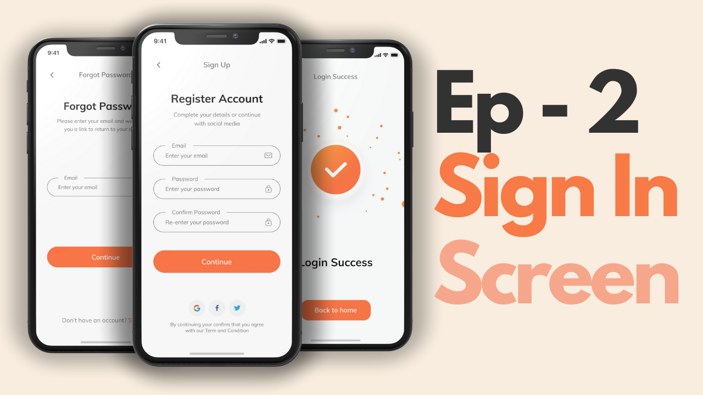
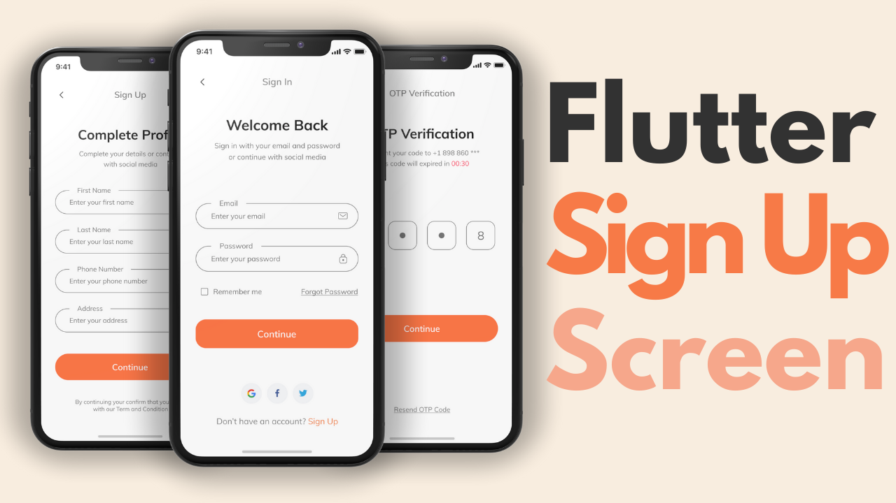
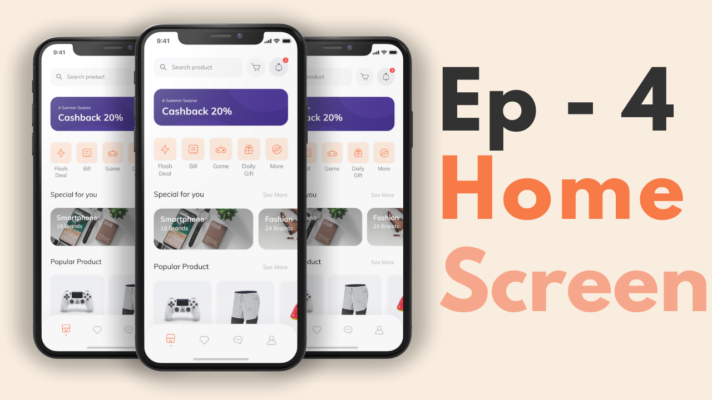
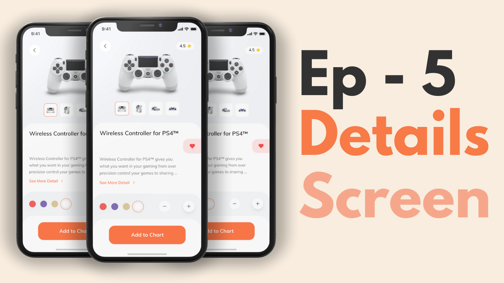
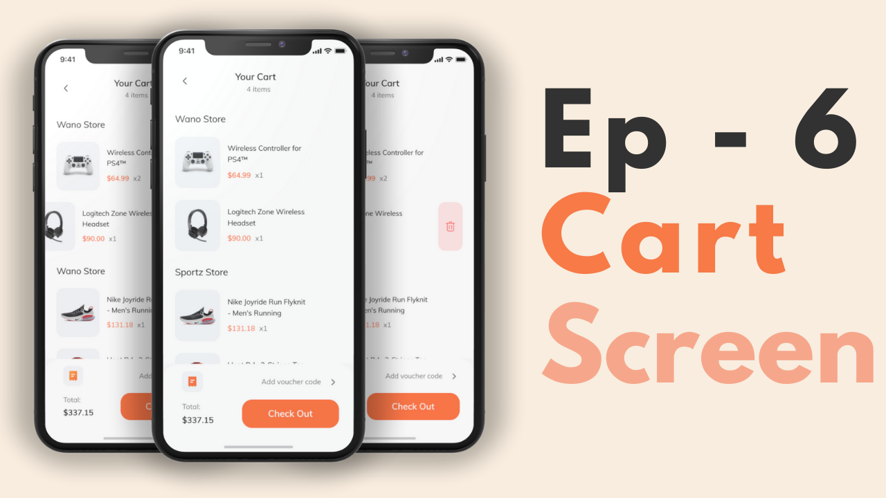
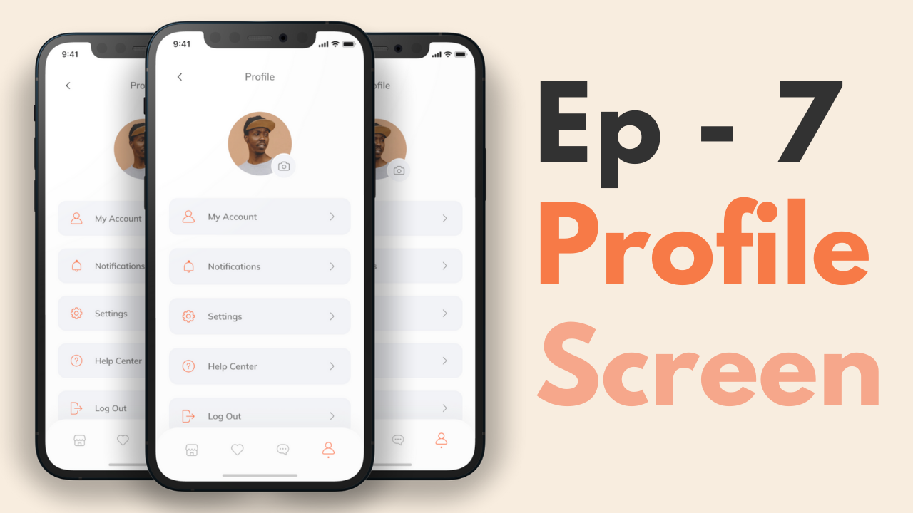

# Flutter E-Commerce App Template

 If you want to learn how to build this ecommerce template on Flutter [watch the playlist on YouTube](https://youtube.com/playlist?list=PLxUBb2A_UUy8OlaNZpS2mfL8xpHcnd_Af), In the first video, we start by making a neat onboarding screen for our shopping app. This works on both Android and iOS because it's made with Flutter. In the next video, we tackle the 'Sign In' and 'Forgot Password' screens, adding some unique error messages. The third video covers the 'Sign Up' and OTP processes. The fourth one is fun – we create the main homepage. In the fifth, we dive into the product page, and in the sixth, we craft an order page with cool features like 'swipe to delete.' Finally, in the seventh video, we design the user profile page.

Visit FlutterLibrary.com to Download the [Flutter e-commerce app template](https://www.flutterlibrary.com/templates/e-commerce-app) & other templates, and components.

### Video Preview of the Shop template

## Screens it contains:

=> Onboarding

=> Login

=> Forgot Password

=> Sign Up

=> Complete Profile

=> OTP Verification

=> Home Page

=> Product Details

=> Order

=> Profile (added)

=> Bottom Navigation Bar (added)

Now it contains all the screen, thanks for your love and support 🙏 

## Photos

